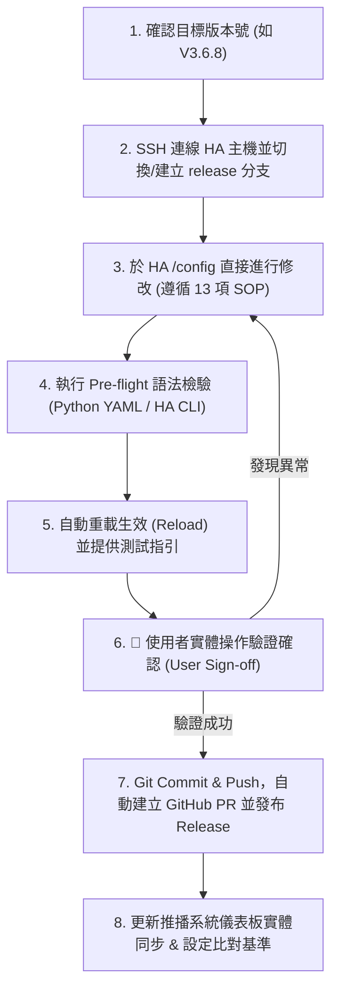

# Home Assistant GitOps & AI 開發升級標準作業程序 (PROJECT_RULES)

## 一、 連線與系統環境資訊（Connection & Environment Profile）

* **SSH 遠端連線**：`kenny1105@192.168.68.97:22` (`homeassistant.local`)
  * **認證方式**：ED25519 SSH 金鑰免密碼連線
  * **權限模式**：`sudo NOPASSWD: ALL`
* **HA 主機設定路徑**：`/config`（即 `/homeassistant`）
* **GitHub 遠端倉庫**：`https://github.com/kennychiang1105/HomeAssistant_Automation`
  * **存取 Token**：`[SECRET_GITHUB_PAT]` (Stored securely in local environment / git credentials)
  * **Git 使用者**：`kennychiang1105` (`kennychiang1105@users.noreply.github.com`)
* **本機歷史備份路徑**：`/Users/kenny/Library/Mobile Documents/com~apple~CloudDocs/Files/01_Documents/02家庭相關/03智慧家庭/AI Program`

---

## 二、 GitOps 標準開發與升級工作流程（GitOps Upgrade Workflow）

每次進行自動化開發、邏輯修改或版本升級時，AI 與開發者必須嚴格遵循以下 7 大步驟：



### 步驟 1：主動確認目標版本號
在進行任何程式碼修改或功能升級前，**若使用者尚未指定新版本號，AI 必須主動向使用者詢問預計開發的目標版本號**（例如 `V3.6.8`、`V3.7.0`）。

### 步驟 2：SSH 連線 HA 主機並建立 Git 分支
1. 透過 SSH 登入 HA 主機：
   ```bash
   ssh -p 22 kenny1105@192.168.68.97
   ```
2. 進入設定目錄並同步最新遠端主分支：
   ```bash
   cd /homeassistant
   sudo git fetch origin main
   sudo git checkout -b release/<目標版號>
   ```

### 步驟 3：直接於 HA 主機進行開發與修改
所有後續的：
* YAML 自動化修訂（`Automations/*AI.yaml`、`automations.yaml`）
* 腳本修訂（`Scripts/*AI.yaml`）
* Helper 套件變更（`packages/helper.yaml`）
* 主設定檔維護（`configuration.yaml`）
* 版本總表與開關指令對照表更新（`AI_VERSION_REGISTRY.md`、`SwitchCommand.md`）

皆**限定在 HA 主機 `/homeassistant` 的 release 分支中執行**，並嚴格遵循**第三章之 13 項核心 SOP 規範**。

### 步驟 4：即時語法檢驗與相容性檢查（Pre-flight Check）
在重載或重啟前，必須在 HA 主機上執行 YAML 語法檢驗：
```bash
python3 -c "import yaml, glob; [yaml.safe_load(open(f)) for f in glob.glob('Automations/*.yaml') + glob.glob('Scripts/*.yaml') + ['configuration.yaml', 'automations.yaml', 'packages/helper.yaml']]; print('ALL YAML SYNTAX OK')"
```

### 步驟 5：重載生效與提供驗證指引
語法檢驗 100% 通過後，重載 Home Assistant 設定使變更立即生效：
1. 重載自動化與腳本。
2. 檢查最新 50 行日誌確認無報錯或崩潰：
   ```bash
   tail -n 50 /homeassistant/home-assistant.log
   ```
3. **主動整理並提供「實體測試指引清單」**，明確列出受影響之實體開關手勢、情境觸發條件或 LINE 推播驗證點。

### 步驟 6：使用者實體操作驗證（User Physical Verification Gate）⚠️ 關鍵卡點
1. **必須由使用者親自在家庭實體環境中進行操作與驗證**（例如：實際按壓實體開關測試單擊/雙擊/長按、觸發情境確認燈光與設備作動、確認 LINE 推播內容符合 SOP 等）。
2. **AI 必須明確等待使用者回報「測試成功 / 驗證通過」**，嚴禁在使用者確認前擅自判定完成或提前 Commit/發佈。
3. **若使用者回報異常**：AI 需根據問題描述立即於主機進行微調修復，重新執行步驟 4 與步驟 5 再次交由使用者驗證；若有必要則執行第五章秒級回滾。

### 步驟 7：使用者確認後 Commit、Push 與自動建立 GitHub Release PR
獲得使用者明確確認驗證成功後，執行版本封裝：
1. **檢查變更狀態並 Commit**：
   ```bash
   sudo git add .
   sudo git commit -m "feat: Upgrade to <目標版號>"
   ```
2. **推送至 GitHub 遠端**：
   ```bash
   sudo git push -u origin release/<目標版號>
   ```
3. **透過 GitHub REST API 自動創建 PR 並發布 Release**：
   * 呼叫 GitHub API 建立 Pull Request。
   * PR 合併後依標準發布格式（包含 Known Bugs、Next Version 與系統日誌）發布 GitHub Release。

### 步驟 8：GitHub Release 發布後之儀表板實體同步與比對基準更新（Post-Release Sync & Baseline Update）
在 GitHub Release 發布完成後，AI 必須立即透過 Home Assistant 服務調用或由系統同步「更新推播系統」儀表板實體與快照基準：

1. **更新手動版本 Helper 實體**（呼叫 `input_text.set_value`）：
   * `input_text.automation_package_version_manual`：更新為最新發布之更新包版本號（例如 `V3.6.9`）。
   * `input_text.automation_framework_version_manual`：更新為最新自動化架構版本（例如 `AI4.0 測試版`）。
   * `input_text.ai_manual_update_note`：更新為本次發布之簡明更新重點與說明（例如 `LINE Bot額度判定修復、Tesla充電完成邏輯優化，AI 4.0測試導入（全新Agent模型完整接管，全面AI化更新）`）。
2. **觸發比對基準按鈕**（呼叫 `input_button.press`）：
   * 目標實體：`input_button.ai_version_snapshot_set_baseline`（目前版本設為比對基準）。
   * 此動作會立即將更新後的版本與設定寫入快照比對歷史（`sensor.ai_version_snapshot_history`），確保每日 `00-2A更新紀錄推播AI` 正常追蹤後續的新變更。


---

## 三、 開發與修改 13 項核心標準作業程序（Core SOPs）

| SOP 編號 | 規範項目 | 核心要求與防呆機制 |
|---|---|---|
| **SOP-1** | LINE 文案原則 | 內容口語易懂，說明事件、系統動作與狀態；**禁止**暴露內部 entity/service 名稱。 |
| **SOP-2** | LINE 分級開關 | 必須經過分級開關判斷（一般 🪧 / 重要 ⚠️ / 緊急 🚨），不可跳過分級直發。 |
| **SOP-3** | Helper 相容性 | 修改前先確認 Helper 存在且型別相容；檔案頂部註記「相容版本：Helpers Vx.y（已確認）」。 |
| **SOP-4** | 版本三方同步 | 每次改動需**同步更新三處**：自動化檔案（`automation_version` / `alias`）、`packages/helper.yaml`、`AI_VERSION_REGISTRY.md`。 |
| **SOP-5** | 更新連結 | 版本與維運通知附上 GitHub Release 網址或可追溯版號。 |
| **SOP-6** | 避免重複通知 | 多段事件流需加去重/合併；除錯通知由 Debug Helper 控管，不額外新增 LINE 發送路徑。 |
| **SOP-7** | 更新紀錄推播 (00-2A) | 00-2A 透過動態快照差異比對僅推播變更項目；改版時需維護快照與對應 Registry。 |
| **SOP-8** | 頂部更新紀錄格式 | 每個 `*AI.yaml` 頂部需維持標準註解區塊（檔名、相容版本、更新紀錄列表）。 |
| **SOP-9** | 版號進位原則 | 功能新增/重構升次版本（`y+1`，如 `V3.3.1 -> V3.4.0`）；修復/微調升修補版（`z+1`，如 `V3.3 -> V3.3.1`）。 |
| **SOP-10** | LINE 發送可靠性 | **一律使用 `script.send_line_to_user`**；發送前必檢 `user_id` 有效性與開關狀態，失敗需 fallback 記錄；PR 需附最小驗證清單。 |
| **SOP-11** | TTS 廣播音量恢復 | 播音前讀取並保存音量（含 fallback）；播音後延遲 2 秒並以 `wait_template`（timeout 12s + `continue_on_timeout: true`）**確保一定恢復原始音量**。 |
| **SOP-12** | 實體開關維護規範 | 查閱 `SwitchCommand.md` 防衝突；**三擊（Triple Press）全戶 100% 絕對專用於緊急模式（05E）**；單擊標配 500ms 長按防呆與 0.5s 消抖延遲；同步維護指令表。 |
| **SOP-13** | 主設定檔規範 | `configuration.yaml` 頂部標準化註解；檢查 HA 版本棄用整合；保護 include 結構；YAML 語法檢查與雙向同步。 |

---

## 四、 機密安全防護與 `.gitignore` 規範（Security Guardrails）

為了確保智慧家庭私密憑證絕不外洩至 GitHub 公開/私有倉庫，`/homeassistant/.gitignore` 必須強制排除以下項目：

```gitignore
# ──────── 敏感憑證與私密金鑰 ────────
secrets.yaml
*.pem
*.key
google_assistant.json

# ──────── 系統動態狀態、資料庫與快取 ────────
home-assistant_v2.db*
*.log*
.storage/
.cloud/
.cache/
.ha_run.lock
.HA_VERSION
.shopping_list.json

# ──────── 多媒體、暫存與大檔 ────────
tts/
image/
dwains-dashboard/
onlineBackupsData/
node-red/
scrypted/
ssl/

# ──────── 系統檔案 ────────
.DS_Store
Thumbs.db
```

---

## 五、 秒級緊急回滾機制（Instant Rollback SOP）

若任何更新在上線後發生異常、邏輯錯誤或導致系統不穩定，可立即執行秒級回滾：

1. **還原所有未提交之修改**：
   ```bash
   cd /homeassistant
   sudo git checkout .
   sudo git clean -fd
   ```
2. **或切回上一版穩定 Commit / Tag**：
   ```bash
   sudo git checkout main
   ```
3. **重新載入 HA 自動化與腳本**，系統將於數秒內 100% 恢復至更動前的穩定狀態。
