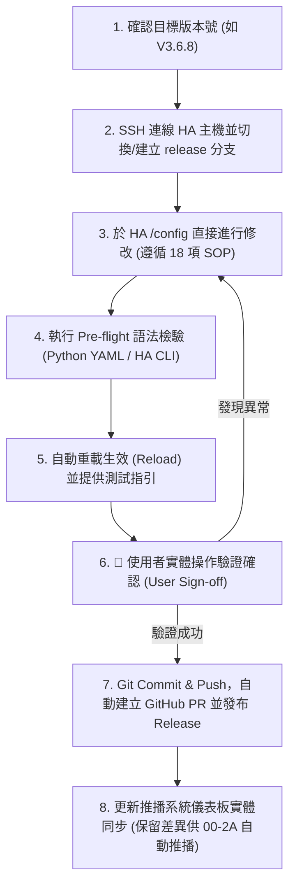

# Home Assistant GitOps & AI 開發升級標準作業程序 (PROJECT_RULES)

## 一、 連線與系統環境資訊（Connection & Environment Profile）

* **SSH 遠端連線**：`kenny1105@192.168.68.97:22` (`homeassistant.local`)
  * **認證方式**：ED25519 SSH 金鑰免密碼連線
  * **權限模式**：`sudo NOPASSWD: ALL`
* **HA 主機設定路徑**：`/config`（即 `/homeassistant`）
* **GitHub 遠端倉庫**：`https://github.com/kennychiang1105/HomeAssistant_Automation`
  * **存取 Token**：`[SECRET_GITHUB_PAT]` (Stored securely in local environment / git credentials)
  * **Git 使用者**：`kennychiang1105` (`kennychiang1105@users.noreply.github.com`)
* **本機歷史備份路徑**：`/Users/kenny/Library/Mobile Documents/com~apple~CloudDocs/Files/01_Documents/02家庭相關/03智慧家庭/AI Program`

---

## 二、 GitOps 標準開發與升級工作流程（GitOps Upgrade Workflow）

每次進行自動化開發、邏輯修改或版本升級時，AI 與開發者必須嚴格遵循以下 7 大步驟：


```mermaid
flowchart TD
    A["1. 確認目標版本號 (如 V3.6.8)"] --> B["2. SSH 連線 HA 主機並切換/建立 release 分支"]
    B --> C["3. 於 HA /config 直接進行修改 (遵循 18 項 SOP)"]
    C --> D["4. 執行 Pre-flight 語法檢驗 (Python YAML / HA CLI)"]
    D --> E["5. 自動重載生效 (Reload) 並提供測試指引"]
    E --> F["6. 🛑 使用者實體操作驗證確認 (User Sign-off)"]
    F -- 驗證成功 --> G["7. Git Commit & Push，自動建立 GitHub PR 並發布 Release"]
    G --> H["8. 更新推播系統儀表板實體同步 (保留差異供 00-2A 自動推播)"]
    F -- 發現異常 --> C
```

### 步驟 1：主動確認目標版本號
在進行任何程式碼修改或功能升級前，**若使用者尚未指定新版本號，AI 必須主動向使用者詢問預計開發的目標版本號**（例如 `V3.6.8`、`V3.7.0`）。

### 步驟 2：SSH 連線 HA 主機並建立 Git 分支
1. 透過 SSH 登入 HA 主機：
   ```bash
   ssh -p 22 kenny1105@192.168.68.97
   ```
2. 進入設定目錄並同步最新遠端主分支：
   ```bash
   cd /homeassistant
   sudo git fetch origin main
   sudo git checkout -b release/<目標版號>
   ```

### 步驟 3：直接於 HA 主機進行開發與修改
所有後續的：
* YAML 自動化修訂（`Automations/*AI.yaml`、`automations.yaml`）
* 腳本修訂（`Scripts/*AI.yaml`）
* Helper 套件變更（`packages/helper.yaml`）
* 主設定檔維護（`configuration.yaml`）
* 版本總表與開關指令對照表更新（`AI_VERSION_REGISTRY.md`、`SwitchCommand.md`）

皆**限定在 HA 主機 `/homeassistant` 的 release 分支中執行**，並嚴格遵循**第三章之 13 項核心 SOP 規範**。

### 步驟 4：即時語法檢驗與相容性檢查（Pre-flight Check）
在重載或重啟前，必須在 HA 主機上執行 YAML 語法檢驗：
```bash
python3 -c "import yaml, glob; [yaml.safe_load(open(f)) for f in glob.glob('Automations/*.yaml') + glob.glob('Scripts/*.yaml') + ['configuration.yaml', 'automations.yaml', 'packages/helper.yaml']]; print('ALL YAML SYNTAX OK')"
```

### 步驟 5：重載生效與提供驗證指引
語法檢驗 100% 通過後，重載 Home Assistant 設定使變更立即生效：
1. 重載自動化與腳本。
2. 檢查最新 50 行日誌確認無報錯或崩潰：
   ```bash
   tail -n 50 /homeassistant/home-assistant.log
   ```
3. **同步更新「自動化管理」面板**（SOP-14）：`python3 scripts/generate_automation_panel.py --deploy`。
4. **主動整理並提供「實體測試指引清單」**，明確列出受影響之實體開關手勢、情境觸發條件或 LINE 推播驗證點。

### 步驟 6：使用者實體操作驗證（User Physical Verification Gate）⚠️ 關鍵卡點
1. **必須由使用者親自在家庭實體環境中進行操作與驗證**（例如：實際按壓實體開關測試單擊/雙擊/長按、觸發情境確認燈光與設備作動、確認 LINE 推播內容符合 SOP 等）。
2. **AI 必須明確等待使用者回報「測試成功 / 驗證通過」**，嚴禁在使用者確認前擅自判定完成或提前 Commit/發佈。
3. **若使用者回報異常**：AI 需根據問題描述立即於主機進行微調修復，重新執行步驟 4 與步驟 5 再次交由使用者驗證；若有必要則執行第五章秒級回滾。

### 步驟 7：使用者確認後 Commit、Push 與自動建立 GitHub Release PR
獲得使用者明確確認驗證成功後，執行版本封裝：
1. **檢查變更狀態並 Commit**：
   ```bash
   sudo git add .
   sudo git commit -m "feat: Upgrade to <目標版號>"
   ```
2. **推送至 GitHub 遠端**：
   ```bash
   sudo git push -u origin release/<目標版號>
   ```
3. **透過 GitHub REST API 自動創建 PR 並發布 Release**：
   * 呼叫 GitHub API 建立 Pull Request。
   * PR 合併後依標準發布格式（包含 Known Bugs、Next Version 與系統日誌）發布 GitHub Release。

### 步驟 8：GitHub Release 發布後之儀表板實體同步（Post-Release Dashboard Sync）
在 GitHub Release 發布完成後，AI 必須立即透過 Home Assistant 服務調用同步「更新推播系統」儀表板手動版本實體（**注意：嚴禁主動按下「目前版本設為比對基準」**，以保留版本差異供每日 18:00 的 `00-2A更新紀錄推播AI` 自動偵測並推播通知）：

1. **更新手動版本 Helper 實體**（`input_text.set_value`）。**沿用歷史寫法**（見資料庫歷史）：
   * `input_text.automation_package_version_manual`：更新包版本，格式 `Vx.y.z`（例：`V3.6.9`、`V4.0`；修補版可加 `Patch (a)`，測試期 `V4.0-beta 8`）。
   * `input_text.automation_framework_version_manual`：架構版本，格式 `AIx.y`（例：`AI3.6`、`AI4.0`；測試期 `AI4.0 Beta 8`）。
   * `input_text.ai_manual_update_note`：**單行**簡明更新重點（≤255 字），開頭寫版本，重點以頓號分隔、結尾可帶一句總結，ASCII 與中文之間不加空格，例：`V4.0：通知分級與統一廣播(合成音檔快取)、氣氛燈情境、…，AI 4.0正式版`。不要用換行或模板。
   * **沒有 API 權杖時的寫入方式（一次性自動化）**：在 `/homeassistant/configuration/Automations/` 新增 `00-2Z發布後同步一次性.yaml`，觸發為 `homeassistant: start`、`delay 00:01:00` 後依序 `input_text.set_value` 上述三個實體；通過 `check_config` 後重啟 HA（先告知使用者），用資料庫確認三個值已更新，再**刪除該檔**（不納入 commit）。
   * 同步時一併處理：頂樓感應週報計數（`counter.topfloor_path_events`／`ghost_line`／`miss_line`／`fallback_off`／`study_max_off`）若累積了測試資料，在同一支一次性自動化內 `counter.reset`。
2. **比對基準設定規則（保留供 00-2A 自動寫入）**：
   * **嚴禁主動按下** `input_button.ai_version_snapshot_set_baseline`（目前版本設為比對基準）。
   * 每日 18:00 `00-2A更新紀錄推播AI` 觸發時，會自動偵測版本差異、發送 LINE 與 HA 系統更新推播，並在推播完成後**自動觸發事件將最新版本寫入快照基準**。
   * （僅在使用者明確要求「靜音/跳過本次更新通知」時，才依指令手動按下設為基準）。


---

## 三、 開發與修改 18 項核心標準作業程序（Core SOPs）

| SOP 編號 | 規範項目 | 核心要求與防呆機制 |
|---|---|---|
| **SOP-1** | LINE 文案原則 | 內容口語易懂，說明事件、系統動作與狀態；**禁止**暴露內部 entity/service 名稱。 |
| **SOP-2** | LINE 分級開關 | 必須經過分級開關判斷（一般 🪧 / 重要 ⚠️ / 緊急 🚨），不可跳過分級直發。 |
| **SOP-3** | Helper 相容性 | 修改前先確認 Helper 存在且型別相容；檔案頂部註記「相容版本：Helpers Vx.y（已確認）」。 |
| **SOP-4** | 版本三方同步 | 每次改動需**同步更新三處**：自動化檔案（`automation_version` / `alias`）、`packages/helper.yaml`、`AI_VERSION_REGISTRY.md`。 |
| **SOP-5** | 更新連結 | 版本與維運通知附上 GitHub Release 網址或可追溯版號。 |
| **SOP-6** | 避免重複通知 | 多段事件流需加去重/合併；除錯通知由 Debug Helper 控管，不額外新增 LINE 發送路徑。 |
| **SOP-7** | 更新紀錄推播 (00-2A) | 00-2A 透過動態快照差異比對僅推播變更項目；改版時需維護快照與對應 Registry。 |
| **SOP-8** | 頂部更新紀錄格式 | 每個 `*AI.yaml` 頂部需維持標準註解區塊（檔名、相容版本、更新紀錄列表）。 |
| **SOP-9** | 版號進位原則 | 功能新增/重構升次版本（`y+1`，如 `V3.3.1 -> V3.4.0`）；修復/微調升修補版（`z+1`，如 `V3.3 -> V3.3.1`）。 |
| **SOP-10** | LINE 發送可靠性 | **一律使用 `script.send_line_to_user`**；發送前必檢 `user_id` 有效性與開關狀態，失敗需 fallback 記錄；PR 需附最小驗證清單。 |
| **SOP-11** | TTS 廣播音量恢復 | 播音前讀取並保存音量（含 fallback）；播音後延遲 2 秒並以 `wait_template`（timeout 12s + `continue_on_timeout: true`）**確保一定恢復原始音量**。合成失敗時**重試最多 3 次，仍失敗只播提示音並發 HA 資訊級通知，不退回即時語音**（`merge_audio: false` 的呼叫除外）。 |
| **SOP-12** | 實體開關維護規範 | 查閱 `SwitchCommand.md` 防衝突；**三擊（Triple Press）全戶 100% 絕對專用於緊急模式（05E）**；單擊標配 500ms 長按防呆與 0.5s 消抖延遲；同步維護指令表。 |
| **SOP-13** | 主設定檔規範 | `configuration.yaml` 頂部標準化註解；檢查 HA 版本棄用整合；保護 include 結構；YAML 語法檢查與雙向同步。 |
| **SOP-14** | 自動化管理面板同步 | 側邊欄「自動化管理」面板（`/homeassistant/automation-panel.yaml`，由 `scripts/generate_automation_panel.py` 產生）。**新增／刪除／改名任何 automation、`input_*`（boolean／number／select／text／datetime／button）、`timer`、`counter` 後，必須重新產生並部署面板**：`python3 scripts/generate_automation_panel.py --deploy`（只改面板內容不需重啟 HA，瀏覽器重新整理即可）；新項目若被分到「其他」或分類不對，請調整腳本內 `AUTO_RULES`／`HELPER_RULES`。面板檔屬產生物，**禁止手改**。詳見下方〈面板更新流程〉。 |
| **SOP-15** | 通知內文圖示 | LINE 卡片與 HA 通知的**內文**由 `custom_templates/notify_body.jinja`（本機副本 `www/custom_templates/`）統一產生：有關鍵字的行前面放小圖示（`www/icons/b/<name>.png`，96px 圓形平面圖示），每種圖示每則最多一次、最多 5 個，其他行純文字；每句（。）自成一行、行距加大、縮排對齊以利手機閱讀。**新增關鍵字或圖示**：改 `pick` 巨集的關鍵字表、把新 PNG 放進 `www/icons/b/`，兩者上傳主機（`/homeassistant/custom_templates/`、`/homeassistant/www/icons/b/`）後**重啟 HA**。標題圖示（`www/icons/*.png`，白色圖示）與內文圖示是兩套，不要混用。 |
| **SOP-16** | 固定廣播句快取暖機 | 一律走 `script.announce`（合成音檔），**不要直接用 `tts.speak`**。分秒必爭的廣播（地震預警等）或需斷網也能播的固定句，要加進 `scripts/warm_announce.py` 的 `build_list()`（提示音檔名＋文字必須與 announce 實際傳入的完全相同，才會命中同一個快取檔），由 `00-2L廣播快取暖機AI` 開機後與每日 03:30 預先合成（即時合成約 1.7 秒、快取約 0.6 秒）。動態秒數／震度類廣播以「預估值 − 已經過時間 − 念到數字前的時間」挑句子。本機副本在 `scripts/`，主機在 `/homeassistant/scripts/`。 |
| **SOP-17** | 實際載入的檔案 | ⚠ **UI 自動化（舊的手動維護自動化）實際載入的是主機 `/homeassistant/automations.yaml`（根目錄）**，不是 `/homeassistant/configuration/automations.yaml`（那份是沒被載入的舊副本，兩者內容不同）。同理主要設定檔是 `/homeassistant/configuration.yaml`（根目錄），不是 `configuration/configuration.yaml`。AI 管理的檔案在 `/homeassistant/Automations/`、`Scripts/`（symlink 到 `configuration/`，這兩個是真的有載入）與 `/homeassistant/packages/`。修改前先 `grep` 確認：`automation: !include automations.yaml` 指向哪一份，改完用 HA 狀態確認別名（含版本）真的變了。 |
| **SOP-18** | Terncy 裝置 id | 自動化裡 Terncy 開關的 `device_id` **以事件（`terncy_pressed`／`terncy_long_press`）實際送出的為準**（舊 id，與 HA 裝置註冊表不同）。HA 啟動日誌的 `was split … can no longer fire` 警告不代表壞掉，**不要**依警告替換 id。改任何 device_id 前先查資料庫 `events` 的 `shared_data.device_id` 確認，改完要實際按開關驗證。 |

### 〈面板更新流程〉（SOP-14 細則）
1. **何時更新**：新增／刪除／改名自動化、新增 helper（含新 package 的 helper）、新增分類時；每次發布版本（步驟 7）前再跑一次確認無遺漏。
2. **如何更新**：在專案資料夾執行 `python3 scripts/generate_automation_panel.py --deploy`。腳本會 SSH 唯讀查詢 HA 紀錄庫目前存在（非 `unavailable`）的實體，依規則分類後產生 YAML 並上傳；本機副本在 `www/automation-panel.yaml`。
3. **新實體要等 HA 已載入**：腳本讀的是「已載入的實體」，所以要先完成步驟 5（重載／重啟）讓新自動化與 helper 出現，再更新面板。
4. **分類規則**：自動化依名稱（`AUTO_RULES`）、helper 依 entity_id／名稱（`HELPER_RULES`）；只會自動歸類符合規則者，其餘進「其他」分頁。看到「其他」有東西就補規則。純狀態／旗標類（`_init`、`_last`、`_flag` 等，見 `FLAG_RE`）會放進「狀態與旗標」卡片。
5. **新增面板分頁**：在腳本的 `CATS` 加一筆（key、標題、icon、說明）並補對應規則。
6. **面板本身的設定**：`/homeassistant/configuration.yaml` 的 `lovelace → dashboards → lovelace-automation`（`mode: yaml`、`filename: automation-panel.yaml`、`show_in_sidebar: true`）。僅在第一次建立或改檔名時需要動它，並需重啟 HA。
7. **失效殘留**：面板「總覽」會顯示已失效（`unavailable`）舊自動化的數量；可到「設定 → 自動化」手動清理（目前沒有 API 權杖，無法由程式代刪）。
8. **驗證**：更新後開啟側邊欄「自動化管理」，確認新項目出現在正確分頁、開關可切換、參數可調整。
9. **版面（2026-10-08 起）**：所有分頁用 layout-card 的 `custom:vertical-layout`（最多 4 欄、每欄最小 340px）：卡片依「說明 → 自動化開關 → 功能小組（`SUBGROUPS` 順序）→ 其他元件種類」排列，程式依估計高度把卡片**按順序**切成最多 4 段放進各欄（`partition()`），欄數不夠時依序往下接——手機 1 欄、iPad 直放 2 欄時順序不變。超過 10 列的清單會拆成連續卡片（標題加「（續）」）。說明卡永遠與下一張卡片同欄。實體來源改讀 `core.restore_state`（最新一批），新增／刪除實體後最多 15 分鐘才會反映。

---

## 四、 機密安全防護與 `.gitignore` 規範（Security Guardrails）

為了確保智慧家庭私密憑證絕不外洩至 GitHub 公開/私有倉庫，`/homeassistant/.gitignore` 必須強制排除以下項目：

```gitignore
# ──────── 敏感憑證與私密金鑰 ────────
secrets.yaml
*.pem
*.key
google_assistant.json

# ──────── 系統動態狀態、資料庫與快取 ────────
home-assistant_v2.db*
*.log*
.storage/
.cloud/
.cache/
.ha_run.lock
.HA_VERSION
.shopping_list.json

# ──────── 多媒體、暫存與大檔 ────────
tts/
image/
dwains-dashboard/
onlineBackupsData/
node-red/
scrypted/
ssl/

# ──────── 系統檔案 ────────
.DS_Store
Thumbs.db
```

---

## 五、 秒級緊急回滾機制（Instant Rollback SOP）

若任何更新在上線後發生異常、邏輯錯誤或導致系統不穩定，可立即執行秒級回滾：

1. **還原所有未提交之修改**：
   ```bash
   cd /homeassistant
   sudo git checkout .
   sudo git clean -fd
   ```
2. **或切回上一版穩定 Commit / Tag**：
   ```bash
   sudo git checkout main
   ```
3. **重新載入 HA 自動化與腳本**，系統將於數秒內 100% 恢復至更動前的穩定狀態。
