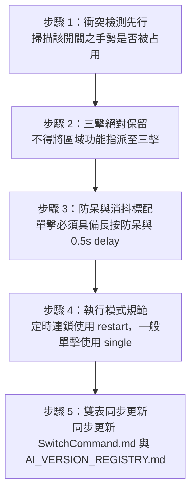

# 全家智慧開關指令總表與維護規範（SwitchCommand）

> **版本**：V3.6.7  
> **更新日期**：2026-08-16  
> **適用範圍**：Home Assistant 2026.8+ 全戶小燕科技（Terncy）開關、小米無線開關及相關連動自動化

---

## 一、 開關核心規範與通用手勢原則

全戶開關嚴格遵循以下「分層統一原則」，避免操作混亂與邏輯衝突：

1. 🚨 **三擊（Triple Press）—— 全戶絕對統一為「緊急模式」**：
   - 全家所有實體開關（小燕 35 個開關 + 小米無線開關）的三擊，**100% 統一綁定為 `05E緊急實體按鈕`**（觸發全家警報、LINE 緊急推播與緊急情境）。
   - **禁止** 將任何區域自訂功能指派至三擊，確保任何人在任何房間連按三下皆能發出求救訊號。
2. 🪜 **樓梯燈校正 —— 虛擬實體按鈕**：
   - 「頂樓四樓樓梯燈校正」已轉移至虛擬實體（`input_button.ding_lou_si_lou_lou_ti_deng_xiao_zheng` / `800-開關系列-12C`），不在實體開關上佔用按鍵，需要校正時可於 HA 儀表板或自動化中一鍵觸發。
3. ⏳ **樓梯間燈定時全開 —— 2F～4F 樓梯開關「單擊」 / 客廳主開關下1「雙擊」**：
   - 2F～4F 樓梯開關單擊、客廳主開關下1 雙擊（`800-開關系列-9B`）點亮全棟樓梯燈，**3 分鐘後自動熄滅**。
   - 配置 `mode: restart`，若在 3 分鐘內手動關閉後再次單擊/雙擊，可**立即重新點亮並重置 3 分鐘計時**。
4. 💡 **樓梯間燈全開常開 —— 2F～4F 樓梯開關「雙擊」**：
   - 2F～4F 樓梯開關雙擊（`800-開關系列-9A`）點亮全棟樓梯燈，**持續常開不自動計時熄滅**。
5. 🌙 **樓梯間燈全關 —— 各樓層樓梯開關「長按」**：
   - 任一樓梯開關長按（`800-開關系列-9C`）可立即手動關閉全棟樓梯燈。
6. 🏡 **全戶情境切換 —— 主要出入口開關**：
   - 大門、車庫、廚房、客廳主開關長按為「離家 / 晚安情境」，雙擊為「早安 / 到家情境」。
7. 🛡️ **單擊長按防呆與消抖規範**：
   - 所有單擊自動化一律配置 **500ms 長按防呆模板**（`device_entities(...)` 檢查最近是否觸發長按），防止長按釋放瞬間誤觸單擊。
   - 所有單擊自動化動作序列末端必須加入 `- delay: '00:00:00.5'`，徹底杜絕雙網關重複封包連點。

---

## 二、 全戶開關指令分類對照總表

### 1. 車庫與大門區域

| 開關名稱 | 設備 ID (Device ID) | 單擊 (Single Press) | 雙擊 (Double Press) | 三擊 (Triple Press) | 長按 (Long Press) |
|---|---|---|---|---|---|
| **車庫主開關1** | `6aa5f4fe1651ab6f47027aa5769a7cf1` | — | 早安 / 到家情境 (`0`) | 🚨 緊急模式 (`05E`) | 離家 / 晚安情境 (`1`) |
| **車庫主燈開關** | `6f569070d383724fefd1af44770b6f20` | 鐵門開關連動 (`10B`) | 鐵門開關連動 (`10B`) | 🚨 緊急模式 (`05E`) | 鐵門開關連動 (`10B`) |

---

### 2. 客廳區域

| 開關名稱 | 設備 ID (Device ID) | 單擊 (Single Press) | 雙擊 (Double Press) | 三擊 (Triple Press) | 長按 (Long Press) |
|---|---|---|---|---|---|
| **客廳主開關下1** | `e35da29662b08cf4ced829f5eb40f179` | —（使用者保留自訂用途） | 樓梯間燈全開 3 分鐘 (`9B`) | 🚨 緊急模式 (`05E`) | 樓梯間燈全關 (`9C`) |
| **客廳主開關下2** | `d6e4551be6bf3fd520f5111e4f02a6cf` | 客廳燈全開/全關 (`5`) | 客廳燈部分開 (`6`) | 🚨 緊急模式 (`05E`) | 客廳風扇切換 (`8`) |
| **客廳主開關下3** | `2b1b9cbffff070f62f05d5f073a16213` | 早安 / 到家情境 (`0B`) | 早安 / 到家情境 (`0B`) | 🚨 緊急模式 (`05E`) | 晚安 / 離家情境 (`1B`) |
| **客廳外開關下1** | `ee6aa6ce640f7123b2469280a5c34a7f` | 客廳燈全開/全關 (`5`) | 客廳燈部分開 (`6`) | 🚨 緊急模式 (`05E`) | 客廳風扇切換 (`8`) |
| **客廳外開關下3** | `40e15319550792730cc46c7e0528c916` | — | 早安 / 到家情境 (`0`) | 🚨 緊急模式 (`05E`) | 離家 / 晚安情境 (`1`) |

---

### 3. 餐廳與廚房區域

| 開關名稱 | 設備 ID (Device ID) | 單擊 (Single Press) | 雙擊 (Double Press) | 三擊 (Triple Press) | 長按 (Long Press) |
|---|---|---|---|---|---|
| **廚房開關2** | `cca5b7ed73a48ddcd08d2b6fac6ab5d6` | 餐廳燈切換 (`2`) | — | 🚨 緊急模式 (`05E`) | 餐廳崁燈/壁燈切換 (`4`) |
| **廚房開關3** | `29a8530c569abeeee2a16c7237a0ed8e` | 早安 / 到家情境 (`0`) | 早安 / 到家情境 (`0`) | 🚨 緊急模式 (`05E`) | 離家 / 晚安情境 (`1`) |
| **廚房燈開關** | `de4044f4d156d13b885a1be8eb61c85b` | — | — | 🚨 緊急模式 (`05E`) | 切換廚房感應燈AI (`10B`) |
| **小米無線開關** | `8a3a83db44f3e7851c3178495daa7b85` | 廚房燈切換 (`10A`) | — | 🚨 緊急模式 (`05E`) | 切換廚房感應燈AI (`10B`) |
| **餐廳廁所開關1** | `011d0fc36adf6381e82c6f7e0f130d49` | — | 車庫燈/樓梯燈連動 (`10`) | 🚨 緊急模式 (`05E`) | 鐵門開關連動 (`10B`) |
| **餐廳廁所開關3** | `262c6697a232d2f41dd879190fdaaa38` | 餐廳燈切換 (`2`) | 早安 / 到家情境 (`0`) | 🚨 緊急模式 (`05E`) | 離家晚安+樓梯燈 (`1B`) |
| **餐廳主開關上3** | `da626557d958c8abedd9f594b1c78019` | 餐廳燈切換 (`2`) | — | 🚨 緊急模式 (`05E`) | — |
| **廁所開關** | `a9caa455edec9bd90f96dcb457a46dc6` | — | — | 🚨 緊急模式 (`05E`) | 廁所手動模式切換 (`08-8B`) |

---

### 4. 樓梯間與書房區域

| 開關名稱 | 設備 ID (Device ID) | 單擊 (Single Press) | 雙擊 (Double Press) | 三擊 (Triple Press) | 長按 (Long Press) |
|---|---|---|---|---|---|
| **二樓樓梯開關** | `7062d71d97dde92c2d03051744e5c81e` | 樓梯間燈全開 3 分鐘 (`9B`) | 樓梯間燈全開常開 (`9A`) | 🚨 緊急模式 (`05E`) | 樓梯間燈全關 (`9C`) |
| **三樓樓梯開關** | `5499e1d5eb0e1e8435c471bafa837ec8` | 樓梯間燈全開 3 分鐘 (`9B`) | 樓梯間燈全開常開 (`9A`) | 🚨 緊急模式 (`05E`) | 樓梯間燈全關 (`9C`) |
| **四樓樓梯開關** | `813b3dcce6997d06a893274a9dd365c6` | 樓梯間燈全開 3 分鐘 (`9B`) | 樓梯間燈全開常開 (`9A`) | 🚨 緊急模式 (`05E`) | 樓梯間燈全關 (`9C`) |
| **四樓開關下1** | `e784cc0dd2d58c48f1fb69e51601d2b3` | 四樓樓梯燈切換 (`12D`) | — | 🚨 緊急模式 (`05E`) | — |
| **四樓樓梯開關上1** | `ad6e414dc8c87f8bb9deb125b792af19` | 頂樓樓梯燈切換 (`12B`) | — | 🚨 緊急模式 (`05E`) | — |
| **四樓樓梯開關上2** | `277ae0fd30a39c811624da70e6a4398f` | 頂樓與四樓樓梯燈 (`12A`) | — | 🚨 緊急模式 (`05E`) | — |
| **書房燈開關** | `9e8508d9a5b67b29b78e5e8f36a377da` | 書房燈手動切換 (`11A`) | — | 🚨 緊急模式 (`05E`) | 切換書房感應燈AI (`11B`) |

---

### 5. 五樓 / 頂樓區域

| 開關名稱 | 設備 ID (Device ID) | 單擊 (Single Press) | 雙擊 (Double Press) | 三擊 (Triple Press) | 長按 (Long Press) |
|---|---|---|---|---|---|
| **五樓開關下2** | `ea7743a9b14b9ce736fb645578dc59db` | 頂樓與四樓樓梯燈 (`12A`) | — | 🚨 緊急模式 (`05E`) | 樓梯間燈全關 (`9C`) |

---

### 6. 虛擬實體按鈕與其他通用開關

| 實體名稱 / 設備 ID | 類型 | 觸發/按法 | 綁定功能說明 |
|---|---|---|---|
| `input_button.ding_lou_si_lou_lou_ti_deng_xiao_zheng` | **虛擬按鈕** | 按下按鈕 | 🪜 **頂樓四樓樓梯燈校正 (`12C`)**（強制開燈並同步切換） |
| 通用實體開關（共 13 個） | 實體開關 | 三擊 (Triple) | 🚨 **緊急模式 (`05E`)** |

---

## 三、 開關類更新與維護標準作業程序（SOP）

未來任何 AI 或開發者針對開關類自動化進行新增、修改或重構時，**必須嚴格遵循以下 5 大標準步驟**：



### SOP-S1：衝突檢測先行（Pre-modification Conflict Check）
* 在為任何實體開關指派新功能（單擊、雙擊、三擊、長按）前，必須檢索 `SwitchCommand.md` 與全域自動化設定檔。
* 確認該開關在該手勢下未被其他自動化綁定，嚴禁多個非互補自動化監聽同一個開關的同一個手勢。

### SOP-S2：三擊手勢絕對專用（Triple-Press Reservation）
* **全戶三擊（`click_times: 3` / `state: triple`）為最高優先權之「緊急模式（05E）」專用手勢**。
* 任何新開關加入系統時，其三擊必須主動加入 `05E緊急實體按鈕`（`1744040282451`）之觸發清單。
* 嚴禁建立非緊急用途的三擊自動化。

### SOP-S3：單擊長按防呆與消抖規範（Debounce & Anti-Misclick Standard）
* 新增或修改任何單擊（`click_times: 1`）自動化時，**必須**加入 500ms 長按防呆條件（詳見第四節範本）。
* 動作序列（`actions`）最後一行必須加入 `- delay: '00:00:00.5'`。

### SOP-S4：執行模式統一規範（Mode Specification）
* 涉及「點亮後延遲 N 分鐘自動關閉」的定時開關自動化（如 `9B`），必須設定為 **`mode: restart`**，確保使用者在計時期間手動關閉後再次點亮時能立即生效並重新計時。
* 無延遲的一般切換型開關設定為 `mode: single`、`max_exceeded: silent`。

### SOP-S5：雙表同步更新（Documentation Synchronization）
* 每次開關自動化變更完成後，必須同步更新：
  1. `SwitchCommand.md`：更新本總表的按法對照與版本紀錄。
  2. `AI_VERSION_REGISTRY.md`：記錄版本升版說明。

---

## 四、 標準開關程式碼架構與 YAML 撰寫範本（HA 2026.8+ 標準）

### 1. 小燕科技（Terncy）開關標準範本

#### 模板 A：單擊定時自動化（`mode: restart`，支援隨時重啟計時）

```yaml
- id: '1692455803063'
  alias: 800-開關系列-9B 樓梯間燈全開一段時間 (單擊)
  description: ''
  triggers:
    - trigger: event
      event_type: terncy_pressed
      event_data:
        device_id: "<開關 device_id>"
        click_times: 1
  conditions:
    - condition: template
      value_template: >-
        
        
        
          
          {{ state_attr(btn, 'event_type') != 'long_press' or (now() - states[btn].last_updated).total_seconds() > 0.5 }}
        
          true
        
  actions:
    - action: switch.turn_on
      target:
        entity_id: switch.stair_lights
    - delay:
        minutes: 3
    - action: switch.turn_off
      target:
        entity_id: switch.stair_lights
    - delay: '00:00:00.5'
  mode: restart
  max_exceeded: silent
```

#### 模板 B：雙擊常開自動化

```yaml
- id: '1692457074428'
  alias: 800-開關系列-9A 樓梯間燈全開 (雙擊常開)
  description: ''
  triggers:
    - trigger: event
      event_type: terncy_pressed
      event_data:
        device_id: "<開關 device_id>"
        click_times: 2
  conditions: []
  actions:
    - action: switch.turn_on
      target:
        entity_id: switch.stair_lights
  mode: single
  max_exceeded: silent
```

#### 模板 C：長按全關自動化

```yaml
- id: '1692457161312'
  alias: 800-開關系列-9C 樓梯間燈全關 (長按)
  description: ''
  triggers:
    - trigger: event
      event_type: terncy_long_press
      event_data:
        device_id: "<開關 device_id>"
  conditions: []
  actions:
    - action: switch.turn_off
      target:
        entity_id: switch.stair_lights
  mode: single
  max_exceeded: silent
```

#### 模板 D：三擊緊急模式（05E）

```yaml
- trigger: event
  event_type: terncy_pressed
  event_data:
    device_id: "<開關 device_id>"
    click_times: 3
```
