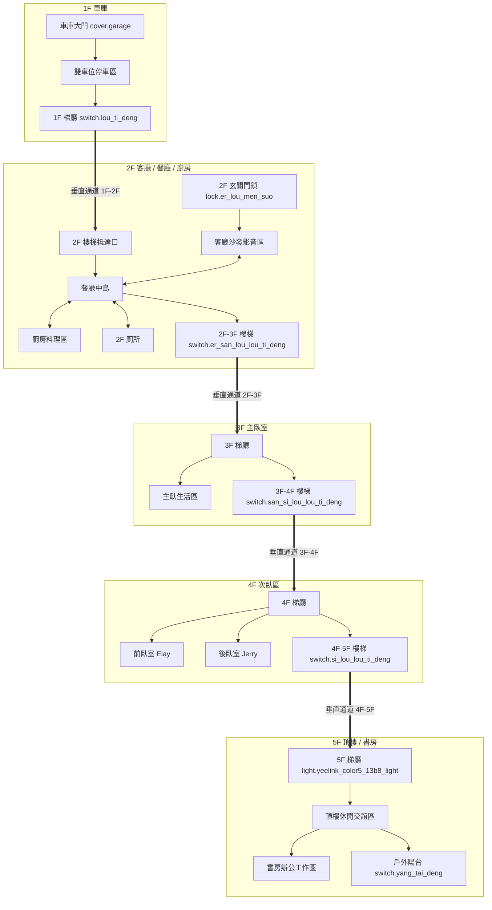

# Chiang Family 空間感知與持久記憶架構 (Spatial Context Memory)

> **版本**：v1.0  
> **建立時間**：2026-10-03  
> **關聯數據庫**：[spatial_scene_graph.json](../spatial_scene_graph.json)  
> **圖面來源**：1F~5F 平面圖 SVG 向量空間解析  

---

## 1. 座標系與空間基準 (Coordinate System Reference)

本智慧家庭採用平面圖 SVG 螢幕座標體系（SVG Standard ViewBox Coordinate System）：
- **原點 (0, 0)**：各樓層圖面之**左上角 (North-West, 西北角)**。
- **X 軸正向 (+X)**：向右，代表**正東方 (East)**。
- **Y 軸正向 (+Y)**：向下，代表**正南方 (South)**。
- **角度 (Yaw) 定義**：
  - `0°`：正東 (+X)
  - `90°`：正南 (+Y)
  - `180°`：正西 (-X)
  - `270°`：正北 (-Y)
  - 計算公式：$\theta = \text{atan2}(y_2 - y_1, x_2 - x_1) \times \frac{180}{\pi}$，並轉換至 $[0, 360)$ 區間。

---

## 2. 樓層分區與實體佈局詳解 (Floor-by-Floor Spatial Layout)

### 1F 車庫區 (Garage & Utility Area)
*圖面尺寸：818 × 519*
- **車庫停車區**：
  - `cover.garage` `(13.0, 212.78)`：車庫電動鐵捲門（西側入口邊緣）。
  - `sensor.garage_temperature` `(13.0, 330.36)`：車庫入口溫濕度感測器。
  - `sensor.parkinggrid1` `(174.97, 184.15)`：車位一（前座車位偵測）。
  - `sensor.parkinggrid2` `(235.61, 184.15)`：車位二（後座車位偵測）。
  - `switch.che_ku_zhu_deng` `(311.02, 184.15)`：車庫中央主照明開關（雙段開關，具備 5 秒防切換保護）。
- **車庫後方設備與梯廳**：
  - `sensor.u6_mesh_1f_state` `(422.23, 426.50)`：1F 無線 AP 節點。
  - `sensor.tesla_wall_connector_status` `(470.62, 426.50)`：特斯拉充電樁（東南側壁掛）。
  - `switch.lou_ti_deng` `(383.50, 473.00)`：1F 往 2F 樓梯起點照明開關。
- **監控攝影機**：
  - `camera.g6_instant_high_resolution_channel`（UniFi G4 Instant）：安裝於東北角 `(387.95, 29.42)`，指向 `141.3°`（西南偏南），水平視角 102.4°（垂直 54.9° / 對角 120.6°），型號為 UniFi G4 Instant，完整監控鐵捲門、雙車位與人車進出動線。

---

### 2F 公共生活區 (Living Room, Dining Room & Kitchen)
*圖面尺寸：995 × 605*
- **玄關與客廳 (Living Room)**：
  - `lock.er_lou_men_suo` `(62.38, 126.98)`：2F 正門/玄關大門智慧鎖。
  - `fan.ke_ting_dian_feng_shan` `(256.40, 226.50)`：客廳立扇。
  - `light.ke_ting_deng_zu_tong_deng` `(193.30, 226.50)`：客廳筒燈群。
  - `light.ke_ting_deng_zu_diao_deng` `(319.50, 226.50)`：客廳中央吊燈。
  - `climate.ke_ting_leng_qi` `(193.30, 94.75)`：客廳冷氣。
  - `switch.ke_ting_dian_shi` `(256.40, 358.25)`：客廳電視影音設備開關。
  - `light.yeelink_color5_lu_deng` `(62.38, 480.07)`：客廳西南側落地燈 / 露台造景燈。
- **餐廳 (Dining Area)**：
  - `light.can_ting_deng_zu_tong_deng` `(582.50, 226.50)`：餐廳主要筒燈群。
  - `light.can_ting_deng_zu_can_diao_deng` `(582.50, 310.00)`：餐桌上方餐吊燈。
  - `media_player.dining_room` `(712.50, 226.50)`：餐廳 HomePod / 語音音響。
  - `sensor.air_purifier_pm25` `(582.50, 94.75)`：空氣清淨機。
- **廚房 (Kitchen)**：
  - `switch.chu_fang_deng` `(846.60, 140.00)`：廚房主燈。
  - `binary_sensor.unknown_zhan_kong` `(846.60, 12.81)`：微波雷達人體存在感測器，指向正南 `90.0°`（直射廚房備料走道）。
  - `binary_sensor.kitchen_motion` `(948.82, 239.47)`：廚房角落紅外線感測器，指向西北西 `194.9°`（覆蓋瓦斯爐與水槽區）。
  - `sensor.kitchen_smoke_detector` / `sensor.kitchen_gas_detector`：安全警戒感測器。
- **廁所與過道 (Restroom & Passage)**：
  - `switch.ce_suo_deng` `(855.39, 490.00)`：2F 客用廁所燈。
  - `binary_sensor.e406bf25caa1_motion` `(855.39, 441.69)`：廁所門口動態感測器，指向正東 `0.0°`（偵測進入廁所與過道的人員）。

---

### 3F 主臥室區 (Master Bedroom Suite)
*圖面尺寸：802 × 519*
- **主臥生活睡眠區**：
  - `light.zhu_wo_chuang_tou_deng` `(246.50, 248.00)`：主臥床頭閱讀燈。
  - `light.zhu_wo_deng_zu_zhu_deng` `(380.00, 248.00)`：主臥室天花板主吸頂燈。
  - `switch.zhu_wo_dian_shi` `(513.50, 248.00)`：臥室壁掛電視插座。
  - `climate.zhu_wo_leng_qi` `(380.00, 105.00)`：主臥冷暖空調。
  - `sensor.u6_pro_state` `(380.00, 391.00)`：3F 高速 Wi-Fi 6 AP 基地台。
- **3F 梯廳與過道**：
  - `switch.er_san_lou_lou_ti_deng` `(581.00, 354.50)`：2F 抵達 3F 樓梯平台開關。
  - `switch.san_lou_lou_ti_deng` `(581.00, 456.00)`：3F 梯廳走廊燈。

---

### 4F 次臥區 (Elay & Jerry's Bedrooms)
*圖面尺寸：846 × 519*
- **前臥室 (Elay Room)**：
  - `switch.qian_wo_shi_deng` `(268.00, 185.00)`：前臥室天花板照明。
  - `climate.qian_wo_shi_leng_qi` `(145.00, 185.00)`：前臥室冷氣。
  - `sensor.elay_room_temp` `(268.00, 95.00)`：室內溫濕度。
- **後臥室 (Jerry Room)**：
  - `switch.hou_wo_shi_deng` `(268.00, 385.00)`：後臥室天花板照明。
  - `climate.hou_wo_shi_leng_qi` `(145.00, 385.00)`：後臥室冷氣。
  - `sensor.jerry_room_temp` `(268.00, 475.00)`：室內溫濕度。
- **4F 梯廳與通道**：
  - `switch.san_si_lou_lou_ti_deng` `(611.50, 380.67)`：3F 抵達 4F 樓梯開關。
  - `switch.si_lou_lou_ti_deng` `(611.50, 464.22)`：4F 梯廳與 5F 起點照明。

---

### 5F 頂樓休閒與書房 (Rooftop Lounge, Study & Balcony)
*圖面尺寸：801 × 519*
- **樓梯抵達口與監控角**：
  - `light.yeelink_color5_13b8_light` `(677.50, 446.36)`：5F 梯廳吸頂燈（彩色氛圍/夜間導引）。
  - `camera.wu_lou_she_ying_ji_high`（UniFi G6 Instant）：安裝於角落 `(696.64, 466.07)`，指向 `203.1°`（西北偏西），水平視角 109.9°（垂直 56.7° / 對角 134.1°），覆蓋 5F 樓梯抵達處、休閒區門廊與全景活動走道。
- **頂樓休閒交誼區**：
  - `light.ding_lou_deng_zu_zhu_deng` `(480.00, 303.00)`：頂樓多功能大廳主燈。
  - `binary_sensor.shu_fang_gan_ying_kai_guan_motion_right` `(616.89, 303.49)`：指向正東 `0.0°`（【使用者確認 2026-10-06】右側感應器＝書房側）。
  - `binary_sensor.shu_fang_gan_ying_kai_guan_motion_left` `(599.66, 302.75)`：指向正西 `180.0°`（【使用者確認 2026-10-06】左側感應器＝房間側）。
- **書房辦公區 (Study Room)**：
  - `switch.shu_fang_zhu_ji` `(210.00, 303.00)`：工作站電腦主機供電。
  - `switch.shu_fang_cha_zuo` `(210.00, 380.00)`：書桌周邊設備總開關。
  - `sensor.study_pc_screen_state` `(210.00, 226.00)`：電腦螢幕/工作狀態偵測。
  - `climate.shu_fang_leng_qi` `(330.00, 120.00)`：書房空調。
- **戶外露台**：
  - `switch.yang_tai_deng` `(120.00, 460.00)`：5F 戶外陽台照明。

---

## 3. 垂直動線與空間拓撲門戶 (Vertical Circulation & Portals)

---

## 4. 監控視野與感測錐體幾何 (Camera FOV & Sensor Beams)

| 設備實體 ID / 型號 | 安裝樓層 | 座標 (X, Y) | 朝向角度 (Yaw) | 八方位 | 水平視角 (FOV) | 盲區 (Blind Spot) 與防區覆蓋說明 |
| :--- | :---: | :---: | :---: | :---: | :---: | :--- |
| `camera.g6_instant_high_resolution_channel` **UniFi G4 Instant** *(標準橫向 / 無走廊模式)* | 1F | (387.95, 29.42) | 141.3° | 西南 (SW) | 102.4° (V:54.9° / D:120.6°) | **覆蓋**：車庫鐵捲門內外、車位一、車位二、中央走道。 **盲區**：攝影機正後方 (東北壁面角落)。人車從鐵捲門進入時必被正面捕捉。 **說明**：標準 16:9 橫向安裝，未開走廊模式，水平 102.4° 廣角橫切停車區。 |
| `camera.wu_lou_she_ying_ji_high` **UniFi G6 Instant** *(標準橫向 / 無走廊模式)* | 5F | (696.64, 466.07) | 203.1° | 西北偏西 (WNW) | 109.9° (V:56.7° / D:134.1°) | **覆蓋**：4F 上 5F 樓梯踏步口、5F 梯廳走廊、休閒臥室大廳入口。 **盲區**：5F 東南側設備牆與死角。任何人上樓踏入 5F 第一步即完全納入視野。 **說明**：標準 16:9 橫向安裝，未開走廊模式，水平 109.9° 超廣角橫切梯廳走廊。 |
| `binary_sensor.unknown_zhan_kong` | 2F | (846.60, 12.81) | 90.0° | 正南 (S) | 雷達波束 (約 120°) | 垂直縱向照射廚房走道，針對料理、備料微動感應極佳。 |
| `binary_sensor.kitchen_motion` | 2F | (948.82, 239.47) | 194.9° | 西北西 (WNW) | PIR (約 90°) | 橫向切入廚房與餐廳交界處，偵測由餐廳走入廚房之瞬時移動。 |
| `binary_sensor.e406bf25caa1_motion` | 2F | (855.39, 441.69) | 0.0° | 正東 (E) | PIR (約 100°) | 正對客廁走廊與門扉，偵測準備如廁或自廁所出來之人員動態。 |
| `binary_sensor.shu_fang_gan_ying_kai_guan_motion_right` | 5F | (616.89, 303.49) | 0.0° | 正東 (E) | PIR (約 90°) | 朝向書房側（使用者 2026-10-06 確認：右＝書房側），捕捉進出書房之人員。 |
| `binary_sensor.shu_fang_gan_ying_kai_guan_motion_left` | 5F | (599.66, 302.75) | 180.0° | 正西 (W) | PIR (約 90°) | 朝向房間（臥室）側（使用者 2026-10-06 確認：左＝房間側），捕捉進出臥室之人員。 |

---

## 5. AI 空間推理與行為決策規則 (AI Spatial Reasoning Directives)

當後續使用者提出情境指令時，AI 必須結合本記憶庫中的空間幾何關係進行直覺且精準的推理：

1. **相對空間稱謂解析**：
   - 「沙發左後方的落地燈」$\rightarrow$ 對應 2F 客廳西南側 `light.yeelink_color5_lu_deng`。
   - 「廚房備料走道上的微動」$\rightarrow$ 對應 2F 正南向雷達 `binary_sensor.unknown_zhan_kong`。
   - 「頂樓書房靠走廊感應開關」$\rightarrow$ 對應 5F 雙向 PIR (`motion_left` / `motion_right`)。

2. **多感測器空間交叉驗證 (Cross-Sensor Spatial Fusion)**：
   - 1F 車庫人車判定：若 `cover.garage` 開啟且 `camera.g6_instant_high_resolution_channel` 偵測到 Motion，優先判斷為車輛進出；若鐵門關閉且僅有中央移動，為單純車庫取物。
   - 廚房靜止存在判定：若 PIR (`kitchen_motion`) 觸發後無動作，但微波雷達 (`unknown_zhan_kong`) 持續為 `on`，代表有人正靜止切菜或洗碗，不可誤關 `switch.chu_fang_deng`。

3. **連續空間動線燈光引導 (Sequential Wayfinding Illumination)**：
   - **車庫夜間返家情境**：1F 車庫感應燈觸發 $\rightarrow$ 預判人員將拾級而上 $\rightarrow$ 聯動點亮 1F 樓梯燈 (`switch.lou_ti_deng`) $\rightarrow$ 2F 餐廳梯廳微光引導。
   - **頂樓夜間工作情境**：5F 樓梯攝影機偵測有人上樓 $\rightarrow$ 自動以低色溫 2700K 漸亮 `light.yeelink_color5_13b8_light` 與 `light.ding_lou_deng_zu_zhu_deng`。
